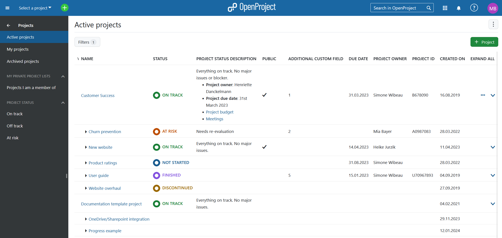
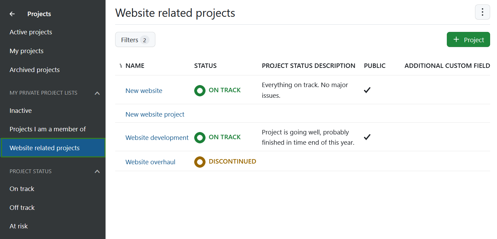
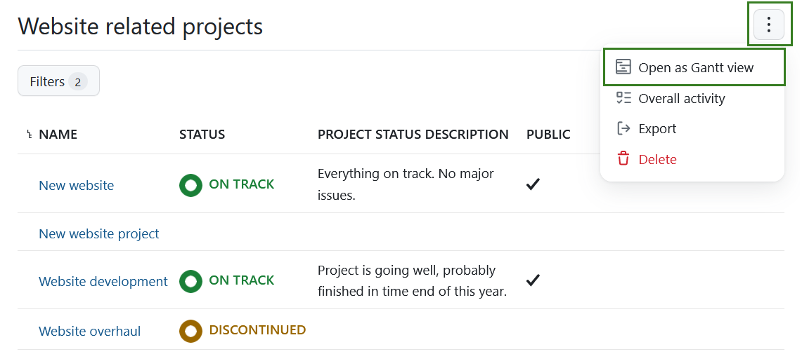
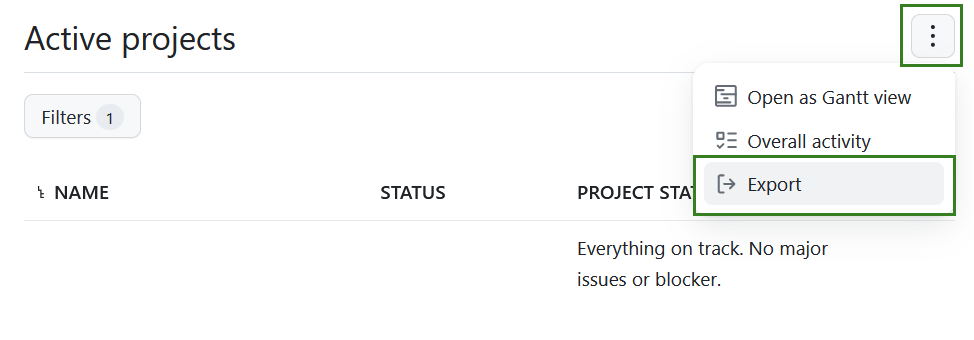
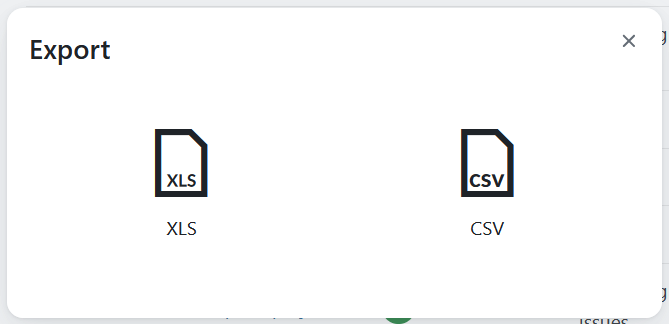
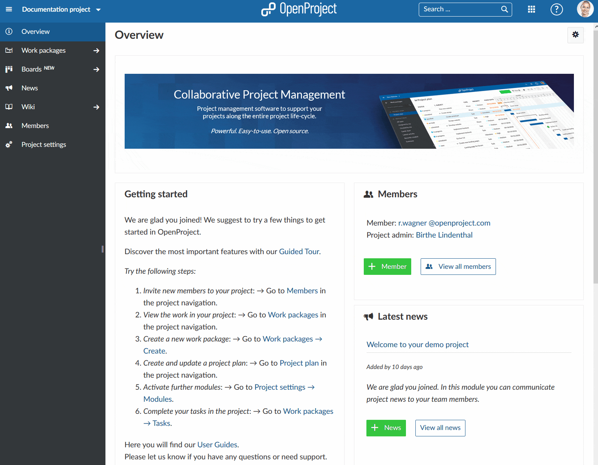

---
sidebar_navigation:
  title: Project lists
  priority: 800
description: Manage project lists in OpenProject
keywords: project lists, project filters, project overview

---

# Project lists

In OpenProject you can create projects to collaborate with your team members, track issues, document and share information with stakeholders and organize things. A project is a way to structure and organize your work in OpenProject.

Your projects can be available publicly or internally. OpenProject does not limit the number of projects, neither in the Community edition nor in the Enterprise cloud or in Enterprise on-premises edition.

| Topic                                                       | Content                                                      |
| ----------------------------------------------------------- | ------------------------------------------------------------ |
| [Select project lists](#select-project-lists)               | Get an overview of all your projects in the project lists.   |
| [Filter project lists](#project-lists-filters)              | Adjust filters in the project lists.                         |
| [Export project list](#export-project-lists)                | You can export the project list to XLS or CSV.               |
| [Project overarching reports](#project-overarching-reports) | How to create project overarching reports across multiple projects. |

## Select project lists

There are several ways to get an overview of all your projects. You can press the **Project lists** button at the bottom of the **Select a project** menu in the top left header navigation. 

Alternatively, you can use the [**Global modules menu**](../../home/global-modules/#projects) and select *Projects*. You can access that menu either on the left side of the OpenProject application homepage or by using the grid menu icon in the top left corner.

You will then get a list of all your active projects in OpenProject. 

### Project lists view explained

You can use this projects overview to **create a multi project status dashboard** if you include your own [project custom fields](../../../system-admin-guide/custom-fields/custom-fields-projects/), e.g. custom status options, Accountable, Project duration, and more.

> **Please note:** Project custom fields are an Enterprise add-on and will only be displayed here for Enterprise on-premises and Enterprise cloud.

With the **arrow** on the right you can display the **project description**.

With the horizontal **three dots** icon on the right side of the list you can open **further features**, such as [creating a new subproject](../#create-a-subproject), [project settings](../project-settings), [archiving a project](../#archive-a-project), [copying](../#copy-a-project) and [deleting a project](../#delete-a-project). Please note that you have to be a System Administrator in OpenProject to access these features. Find out how to un-archive projects [here](../#archive-a-project).

You can choose the **columns displayed by default** in the [System settings](../../../system-admin-guide/system-settings/project-system-settings) in the Administration. 

To change the order of the displayed [custom fields](../../../system-admin-guide/custom-fields) (columns) follow the instructions here: [Displaying a project custom field](../../../system-admin-guide/custom-fields/custom-fields-projects/#display-project-custom-fields).

### Project lists filters

Projects can be filtered in OpenProject. The default view will list all currently active projects. Project filters include:

**Active projects** - returns all projects that are active, of which you are a member or have the right to see.

**My projects** - returns all active projects that you are a member of. 

**Archived projects** - returns all projects that are not active, of which you were a member or have the right to see.

**My private project lists** - shows all the project filters that you have customized and saved. 

**Project status** - includes projects filters based on a project status. 

- **On track** - returns all active projects with the project status *On track*.
- **Off track** - returns all active projects with the project status *Off track*.
- **At risk** - returns all active projects with the project status *At risk*.

To adjust the project lists view use the **Filters** button, select the filtering criteria you require and click the blue **Apply** button.

If you want to save this filtered list use the menu in the far right corner (three dots) and click **Save**.

You will then need to enter the name for the filtered view and click the green **Save** button. 

Your saved project lists filter will appear on the left side under **My private project lists**.

You can always remove your private project lists by using the **Delete** option.

### Gantt chart view

To **display the work packages** of all your projects **in a Gantt chart** click on the **Open as Gantt view** icon on the upper right. This is a shortcut to quickly get to the report described in the [section below](#project-overarching-reports). 

The Gantt chart view can be configured in the [System settings](../../../system-admin-guide/system-settings/project-system-settings) in the Administration.

Alternatively you can also select the [Gantt charts from the global modules menu](../../home/global-modules/#gantt-charts) and adjust it further.

### Overall activity

Besides the Gantt chart view and the filter function for the project lists, you can also access the activity of all users in all active projects. 

Alternatively you can also use the **Activity module** from the [global modules menu](../../home/global-modules/#activity).

By selecting *Overall activity* you can open a view in which all the latest global project activities are documented. In the menu on the left side you can filter the activity by different areas to control e.g. the activity of work packages, wiki pages or meetings.

## Export project lists

You can export a project list by clicking on the three dots in the upper right hand corner and selecting > **Export**.

Next, you can select the format in which you want to export the project list.

It can be exported as .xls or .csv.

## Project overarching reports

Often you need to see information about more than one project at once and want to create project overarching reports. 

Click on the **Modules** icon with the nine squares in the header navigation. These are the [global modules in OpenProject](../../home/global-modules/).

Here you will find global (project overarching) overviews of the following modules, including:

- The global project lists
- The global activity module
- The global work package tables (see below)
- The global Gantt charts module
- The global calendars module
- The global team planner module
- The global boards module
- The global news overview
- The global time and costs module
- The global meetings module

### Global work package tables

Select **Work packages** from the drop down menu **Global modules** in the upper right (nine squares). Now, you will see all work packages in the projects for which you have the required [permissions](../../../system-admin-guide/users-permissions/roles-permissions/).

In this project overarching list, you can search, filter, group by, sort, highlight and save views the same way as in the [work package table](../../work-packages/work-package-table-configuration) in each project.

You can group by projects by clicking in the header of the work package table next to PROJECT and select **Group by**. Collapsing the groups will allow you an **overview of the projects' aggregated milestones** as described [here](../../work-packages/work-package-table-configuration/#flat-list-hierarchy-mode-and-group-by).

